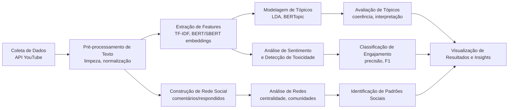

# special-topics-ifpb

This repository contains the projects, activities, and experiments for the special topics course. In this case, the topics are focused on the area of ​​data analysis.

> Skit-learn
>
> Pandas
>
> PySpark
>
> Streamlit
>
> Numpy
>
> PlotPy

[dados de acidentes](https://www.gov.br/prf/pt-br/acesso-a-informacao/dados-abertos/dados-abertos-da-prf)

