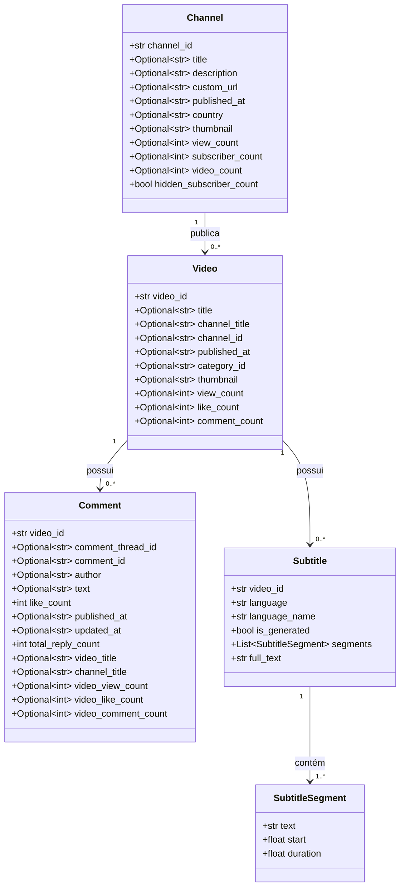
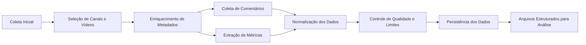

```
Channel
 └── Video
      ├── Comment
      └── Subtitle
            └── SubtitleSegment
```



```
Canal do YouTube
      ↓
Metadados do Vídeo
      ↓
 ┌───────────────┬────────────────┐
 ↓               ↓                ↓
Comentários   Legendas      Métricas
```

```
Coleta Inicial
    └── Seleção de canais e vídeos
            └── Enriquecimento de metadados
                    ├── Comentários
                    ├── Métricas
                    └── Normalização
                            └── Persistência
                                    └── Dados para análise
```

